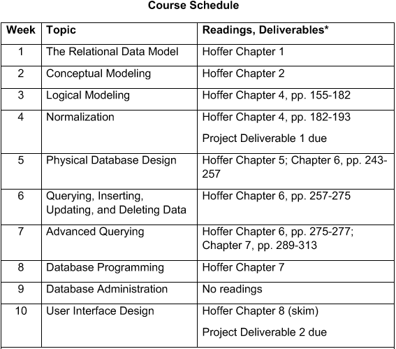

## Ryan Timbrook (Graduate Student - Course Work Repository)

## [Syracuse University, Masters of Applied Data Science](https://ischool.syr.edu/academics/graduate/masters-degrees/ms-in-applied-data-science/)

### IST 659 Database Administration Concepts and Database Management - Summer 2018
### SYLLABUS

                                   **SYRACUSE UNIVERSITY School of Information Studies**
                            **IST - 659 Database Administration Concepts and Database Management**    

**Corequisite** (preferred but not required): 
* IST552: Information Systems Analysis: Concepts and Practice 
* IST352: Information Analysis of Organizational Systems 

**Audience:**
This course is aimed at information professionals and serves as a foundational introduction to the field of data and database management. 

**Description:**
IST 659 is an introductory course to database management systems. This course examines data structures, file organizations, concepts, and principles of database management systems (DBMS) as well as data analysis, database design, data modeling, database management, and database implementation. More specifically, it introduces hierarchical, network, and relational data models; entity-relationship modeling; basics of Structured Query Language (SQL); data normalization; and database design. Using Microsoft’s Access and SQL Server DBMSs as implementation vehicles, this course provides hands-on experience in database design and implementation through assignments, lab exercises, and course projects. This course also introduces advanced database concepts such as transaction management and concurrency control, distributed databases, multitier client/server architectures, web-based database applications, data warehousing, and NoSQL.

**Learning Objectives:**
After taking this course, the students will be able to:   
* Describe fundamental data and database concepts Explain and use the database development lifecycle Create databases and database objects using popular database management system products 
* Solve problems by constructing database queries using Structured Query Language (SQL) 
* Design databases using data modeling and data normalization techniques 
* Develop insights into future data management tool and technique trends Recommend and justify strategies for managing data security, privacy, audit/control, fraud detection, backup and recovery 
* Critique the effectiveness of DBMS in computer information systems 

**Weekly Schedule:**

[SYRACUSE UNIVERSITY School of Information Studies](https://ischool.syr.edu/)
